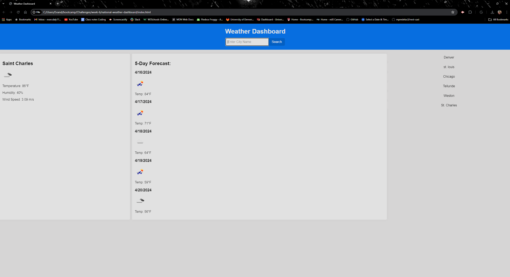

# national-weather-dashboard

## Description
An app to look up the current and 5 day weather forecast for any city in the United States.
This challenge was beneficial in helping me understand the way API's work. 

## Usage 

Link - https://evandaly27.github.io/national-weather-dashboard/

## Credits
YouTube
Google 
Xpert Learning Assistant 
W3 Schools
MDN Docs